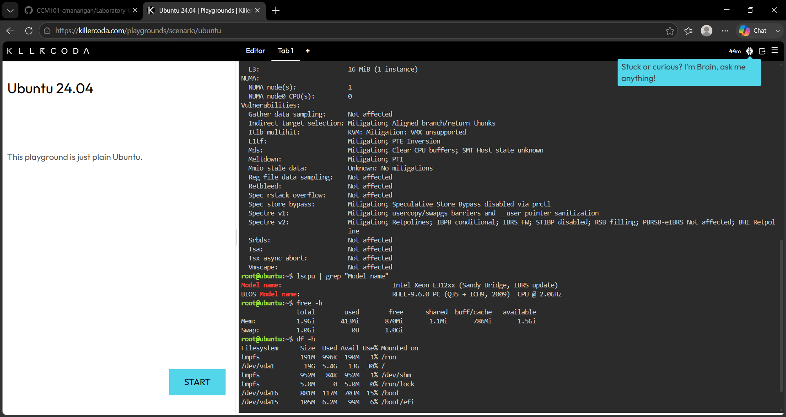

# KillerCoda Linux Investigation

## Linux Server Information

| Category | Information |
|---|---|
| Operating System | Ubuntu |
| CPU | Intel Xeon E312xx (Sandy Bridge, IBRS update)|
| Memory | 1.9Gi |
| Disk Space | 19 GB total, 5.4 GB used, 13 GB available, 30% used |

## Cloud Hosting Options

If this Linux server were migrated to the cloud, it could be hosted using virtual machine services from AWS, Microsoft Azure, or Google Cloud.

| Cloud Provider | Service | Purpose |
|---|---|---|
| AWS | Amazon EC2 | Hosts Linux virtual machines |
| Microsoft Azure | Azure Virtual Machines | Hosts Linux virtual machines |
| Google Cloud | Compute Engine | Hosts Linux virtual machines |

## Explanation

The Linux server could be migrated to any of the three major cloud platforms because AWS, Azure, and Google Cloud provide virtual machine services that support Linux workloads. Amazon EC2, Azure Virtual Machines, and Compute Engine can provide the computing resources needed to run the server in the cloud.

## KillerCoda Screenshot

