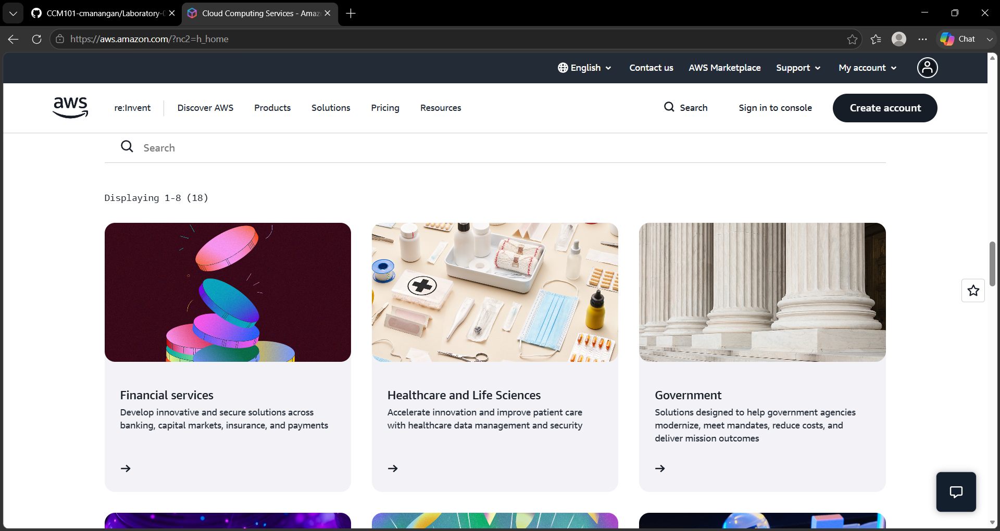

# AWS Research

## Brief Overview

Amazon Web Services (AWS) is a cloud computing platform that provides many services for computing, storage, databases, networking, security, and application development. Organizations can use AWS cloud resources instead of managing all physical infrastructure themselves. AWS is the world's most comprehensive cloud, enabling organizations to accelerate innovation, reduce costs, and scale more efficiently

## Global Infrastructure

The AWS Cloud spans 123 Availability Zones within 39 Geographic Regions, with announced plans for 7 more Availability Zones and 2 more AWS Regions in the Kingdom of Saudi Arabia, and Chile.

## Cloud Management Console

The AWS Management Console is a web-based interface used to access and manage AWS services. Users can use the console to create, configure, monitor, and manage cloud resources.

## Four Core Services

1. **Amazon EC2** – A compute service used to run virtual servers in the cloud.
2. **Amazon S3** – An object storage service used to store files, images, backups, and other data.
3. **Amazon RDS** – A managed relational database service used to run databases.
4. **AWS IAM** – An identity and access management service used to control access to AWS resources.

## Three Advantages

1. AWS provides a wide range of cloud services.
2. AWS has a large global infrastructure.
3. AWS resources can be scaled according to business needs.

## Typical Enterprise Use Cases

AWS can be used by enterprises for:

- Web and mobile applications
- Data storage and backup
- Enterprise databases
- E-commerce applications
- Artificial intelligence and machine learning
- Application hosting

## Screenshot

